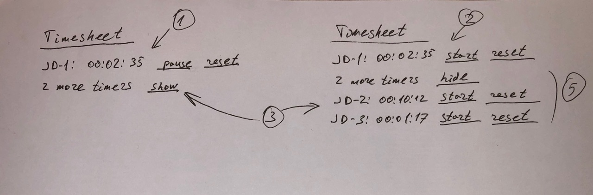

# Задание

Написать реализацию компонента DashboardTimer (src/components/Timer/DashboardTimer.jsx) в рамках существующей структуры кода.

Основной компонент – src/components/Timer/IssueTimer.jsx.

В рамках DasboardTimer необходимо решить несколько задач:

1. В верхней части отображать текущий активный таймера в формате "JD-1: 00:02:35 [остановить/запустить][сбросить]"
2. Если все таймеры на паузе, то сверху отображается последний измененный таймер (по полю lastUpdate)
3. Таймеров может быть несколько (один запущен, несколько на паузе) и тогда нужно показать кнопку "показать ещё", которая развернет список остальных таймеров на паузе
4. Кнопки остановить/запустить/сбросить работают и приводят к смене состояния таймера
5. При запуске другой задачи из раскрытого списка необходимо обновить состояние объектов, чтобы после закрытия нижнего списка страницы задачи отсортировались исходя из пунктов 1 и 2, при этом до закрытия нижнего списка порядок меняться не должен

